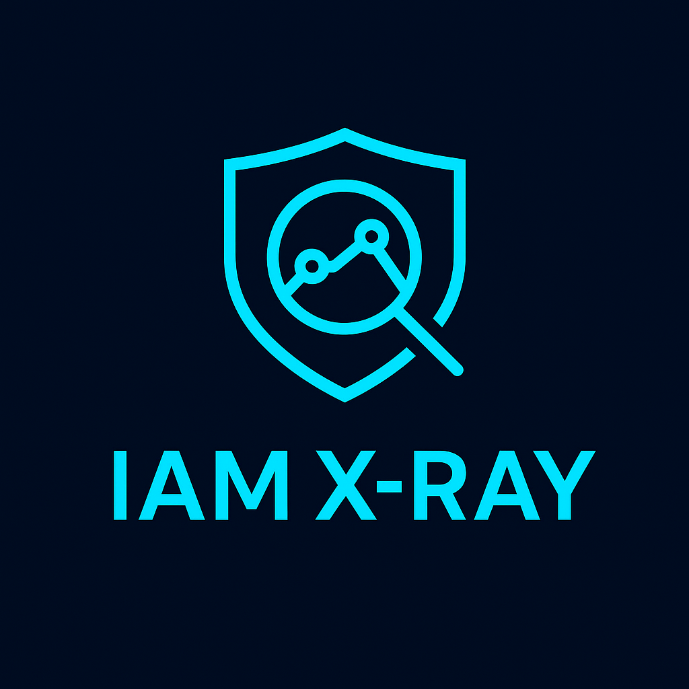
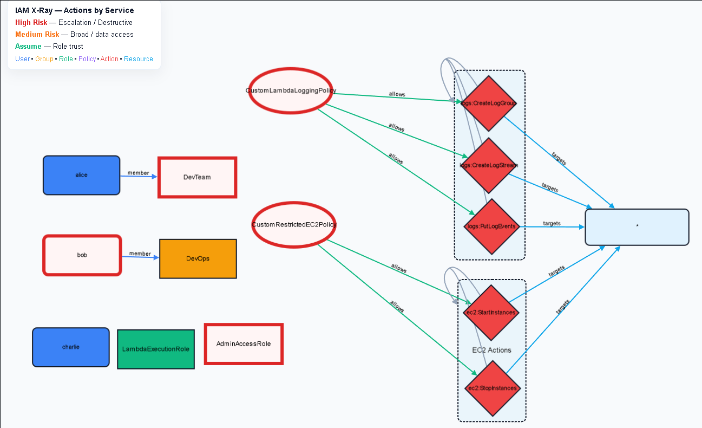
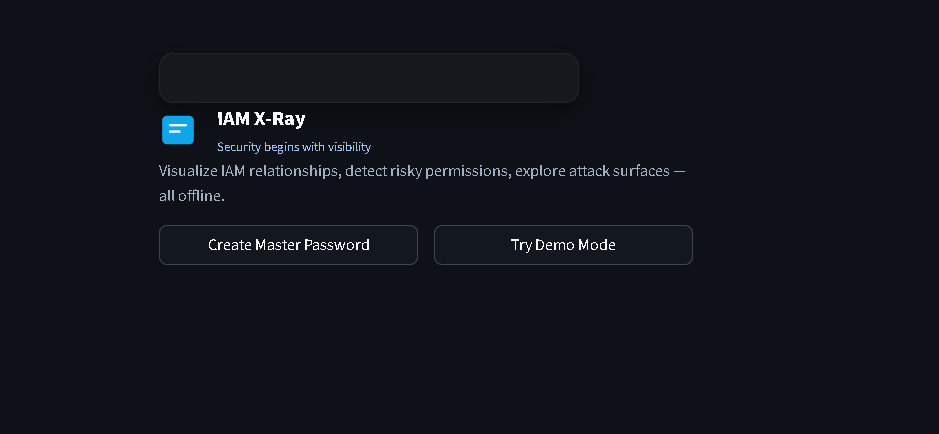
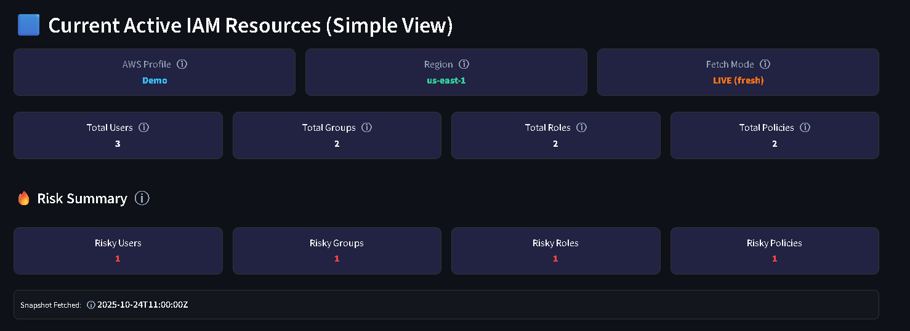

# 🔍 **IAM X-Ray — AWS IAM Attack Graph & Risk Analyzer (v0.1.0-beta)**

**Modern. Visual. Secure. 100% Local.**

> “Defenders think in lists. Attackers think in graphs. As long as this is true, attackers win.”  
> — _John Lambert, Microsoft Security_

<p align="center">
  
</p>

<p align="center"><strong>Modern. Visual. Secure. 100% Local.</strong></p>

[](https://github.com/MaheshShukla1/IAM-X-Ray/releases)
[](https://github.com/MaheshShukla1/IAM-X-Ray/stargazers)
[](https://github.com/MaheshShukla1/IAM-X-Ray/issues)
[](https://github.com/MaheshShukla1/IAM-X-Ray/actions)
[](https://hub.docker.com/r/MaheshShukla1/iam-xray)
[](https://www.python.org/downloads/)
[](LICENSE)
[](LICENSE_NONCOMMERCIAL.md)

## 🎥 Demo Video (Watch First)

This demo shows:

- IAM attack graph in action
    
- Risky permissions highlighted
    
- Demo mode (no AWS needed)
    
- One-command Docker run
    

---

## 🖼 Screenshots

### 🕸 IAM Attack Graph (Users → Roles → Policies → Services)



### 🔐 Secure Onboarding & Vault



### 📊 IAM Summary & Risk View



---

## ❓ What is IAM X-Ray?

AWS IAM is powerful but extremely hard to reason about at scale.

IAM X-Ray is a **local-first AWS IAM analysis tool** that converts:

- IAM Users
    
- Roles
    
- Groups
    
- Policies
    
- Trust relationships
    

into an **interactive attack graph**.

It helps you quickly answer:

- Who can access what?
    
- Where are privilege-escalation paths?
    
- Which permissions are risky?
    
- What changed since last scan?
    

✅ No backend  
✅ No cloud uploads  
✅ Runs fully on your machine

---

## ✨ Key Features

- 🕸 **Interactive IAM Attack Graph**
    
- 🔎 **Risk scoring & wildcard detection**
    
- 🔐 **Secure local vault (password protected)**
    
- 🧪 **Demo mode (no AWS credentials required)**
    
- 🔄 **Snapshot diff (added / removed / modified)**
    
- 🐳 **One-command Docker deployment**
    
- 💻 **Works on Windows, macOS & Linux**
    

---

# ⚡ Quick Start

### Clone & Run (Dev mode)

```bash
git clone https://github.com/MaheshShukla1/IAM-X-Ray.git
cd IAM-X-Ray
docker-compose up --build
```


---

# 🐳 Docker Deployment (Recommended)

### 1️⃣ Pull Image:

```bash
docker pull maheshcloud1/iam-xray:v0.1.0-beta
```

### 2️⃣ Run with AWS CLI Profiles (Windows/Mac/Linux)

```bash
docker run -p 8501:8501 \
  -v "${USERPROFILE:-$HOME}/.aws:/home/iamx/.aws:ro" \
  -v "$(pwd)/data:/app/data" \
  maheshcloud1/iam-xray:v0.1.0-beta
```


Open:  
👉 [http://localhost:8501](http://localhost:8501)

## 🔐 Use With AWS Credentials

### Option A — AWS CLI Profiles (Recommended)

IAM X-Ray automatically detects profiles from `~/.aws`.

Works in:

- Windows
    
- macOS
    
- Linux
    

### Option B — Environment Variables

```bash
docker run \
  -e AWS_ACCESS_KEY_ID=KEY \
  -e AWS_SECRET_ACCESS_KEY=SECRET \
  -e AWS_SESSION_TOKEN=TOKEN \
  -p 8501:8501 \
  maheshcloud1/iam-xray:v0.1.0-beta
```

## 🧪 Demo Mode (No AWS Required)

IAM X-Ray ships with a **prebuilt demo snapshot**.

Use:

- Onboarding → **Demo Mode**
    
- Sidebar → **Mode → Demo**
    

Perfect for:

- Learning IAM
    
- Demos
    
- Interviews
    
- Quick validation
    

---

## 🧠 How the IAM Attack Graph Works

IAM X-Ray analyzes:

- IAM policies (managed + inline)
    
- Trust policies (STS / AssumeRole)
    
- Action → resource mappings
    
- Permission combinations
    

Then builds a **trimmed, readable graph** highlighting:

- Wildcards (`*`)
    
- PassRole → EC2/Lambda escalation
    
- Admin-equivalent permissions
    
- STS role chaining
    
- Toxic permission combinations
    

---

## 🥊 Why IAM X-Ray?

|Feature|IAM X-Ray|PMapper|Aaia|IAM APE|
|---|---|---|---|---|
|Visual Graph UI|✅|❌|❌|❌|
|Demo Mode|✅|❌|❌|❌|
|Snapshot Diff|✅|⚠|❌|❌|
|Risk Scoring|⭐ Rich|Basic|❌|⚠|
|Docker One-Command|✅|⚠|❌|❌|
|Fully Local|✅|⚠|❌|⚠|

IAM X-Ray focuses on **clarity, usability, and speed**, not just raw analysis.

---

## 🔐 Security Model

- All data stored locally
    
- Optional encrypted snapshots
    
- Password-protected vault
    
- No telemetry
    
- Non-root Docker user
    
- Offline-first design
    

---

## 🛣 Roadmap (Post-Beta)

- Entity inspector
    
- Service access heatmaps
    
- Advanced escalation simulator
    
- CloudTrail ingestion
    
- MITRE ATT&CK mapping
    
- Multi-account graphs
    

---

# 🧱 Project Structure

```text
IAM-X-Ray/
├── app/
│   ├── main.py
│   └── assets/
├── core/
│   ├── auth.py
│   ├── cleanup.py
│   ├── config.py
│   ├── graph_builder.py
│   ├── secure_store.py
│   └── fetch_iam/
│       ├── engine.py
│       ├── iam_policies.py
│       ├── iam_principals.py
│       ├── trust_policy.py
│       ├── resolver.py
│       ├── resource_fetch.py
│       └── metadata.py
├── data/
├── Dockerfile
├── docker-compose.yml
├── requirements.txt
└── tests/
```


---

# 🧪 Running Tests

```bash
pytest --cov=core --cov=app
```


# 🤝 Contributing

PRs welcome.

---

## 📄 License

Released under **BUSL-1.1 (Non-Commercial)**  
Commercial licensing available.

📧 Contact: **maheshcloudsec1@gmail.com**
---

⭐ If this project helps you, please give it a star on GitHub — it really helps visibility and future development.

